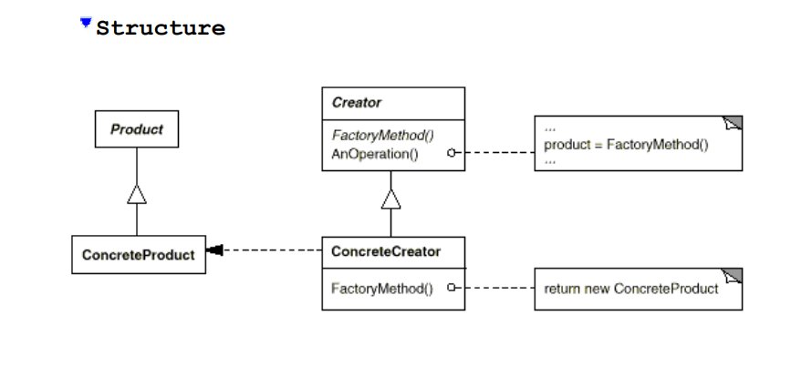

# Factory

Define an interface for creating an object, but let subclasses decide
which class to instantiate. Factory Method lets a class defer instantiation 
Design Patterns: Elements of Reusable Object-Oriented Software to subclasses. 

> (Design Patterns: Elements of Reusable Object-Oriented Software).

**Participants**

- **Product** (Document)
  - Defines the interface of objects the factory method creates. 
- ConcreteProduct (MyDocument)
  - Implements the Product interface.
- Creator (Application)
  - Declares the factory method, which returns an object of type Product. Creator may also define a default implementation of the factory method that returns a default ConcreteProduct object. 
  -  May call the factory method to create a Product object.
- ConcreteCreator (MyApplication)
  - Overrides the factory method to return an instance of a ConcreteProduct. 