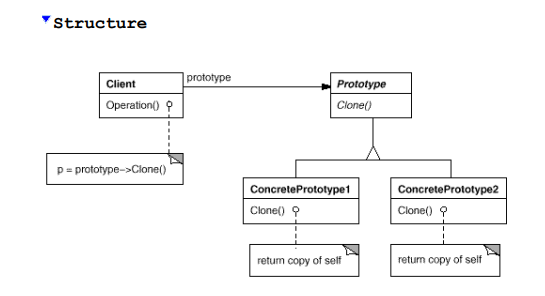

# Prototype

Specify the kinds of objects to create using a prototypical instance,
and create new objects by copying this prototype. 

> (Design Patterns: Elements of Reusable Object-Oriented Software).

**Participants**

- **Prototype**
  - Declares an interface for cloning itself.
- **ConcretePrototype**
  - Implements an operation for cloning itself.
- **Client** 
  - Creates a new object by asking a prototype to clone itself.

**Implementation**

A simple implementation of shapes (Circle and rectangle) with the ability of clone.