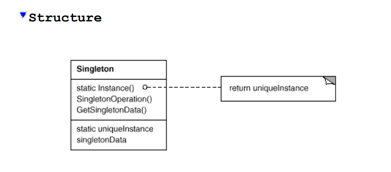

# Singleton

Ensure a class only has one instance, and provide a global point of
access to it. 

> (Design Patterns: Elements of Reusable Object-Oriented Software).

**Participants**

- **Singleton**
  - Defines an Instance operation that lets clients access its unique instance. Instance is a class operation (that is, a class method in Smalltalk and a static member function in C++).
  - May be responsible for creating its own unique instance. 